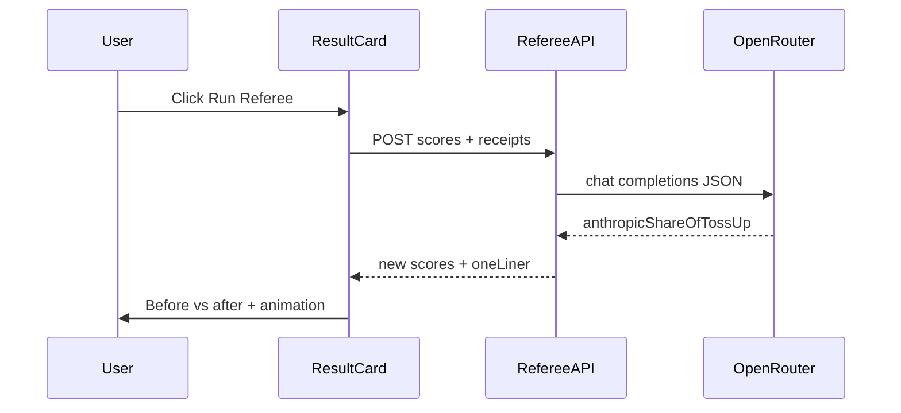

# OpenRouter Referee (hackathon scope)

## Goal

Let users click a **button** to run a lightweight LLM “Referee” that judges ambiguous (toss-up) lab alignment and returns **updated** Open / Anthropic / Toss-up percentages. Show **before vs after** (per your choice). Keep prompting minimal (e.g. which way the ambiguous tweets swing). Light animation (CSS `transition` on spectrum / pills; optional subtle pulse while loading).

## Non-goals

- No DB persistence of referee output (session-only until next full score).
- No new dependencies unless unavoidable (no Framer Motion in stack today).

## Environment

- `OPENROUTER_API_KEY` — required on server for `/api/referee`.
- Optional `OPENROUTER_REFEREE_MODEL` — default to a small/cheap OpenRouter model id (user can swap to Grok or similar).

Document in README or a one-line comment in `route.ts` so deploy env is obvious (minimal doc per time box).

## Server: `/app/api/referee/route.ts`

- **POST** body: client sends current `scores` + `receipts` (subset or full `SlopScoreResult` fields needed).
- Filter receipts with **`isTossUpContributor`** (see below). Cap list (e.g. 10–12) by recency to control tokens.
- If `scores.tossUp` is 0 or no candidate receipts: return **400** with clear message (button should be hidden or disabled in UI too).
- Build short user prompt: numbered tweet texts + instruction to output **only JSON**, e.g. `{ "anthropicShareOfTossUp": 0.0-1.0, "oneLiner": "optional" }` where that share is how much of the **existing toss-up percentage** moves to Anthropic; remainder to OpenAI; set new `tossUp` to `0` (or tiny epsilon if you want to preserve a sliver — default **0**).
- `fetch("https://openrouter.ai/api/v1/chat/completions", …)` with `Authorization: Bearer …`, `HTTP-Referer` / `X-Title` optional for OpenRouter rankings.
- Parse JSON from assistant content; clamp share to `[0,1]`; compute `{ openAI, anthropic, tossUp }` deterministically on server so totals stay ~100.
- **503** if API key missing; **502** on upstream failure; never expose the key to the client.

## Heuristic / types

- Extend [`lib/scoring/types.ts`](lib/scoring/types.ts): optional `isTossUpContributor?: boolean` on `ScoreReceipt`.
- In [`lib/scoring/heuristic.ts`](lib/scoring/heuristic.ts), when `postOpen > EPS && postAnth > EPS` before pushing the receipt, set `isTossUpContributor: true` on that receipt object.

## UI — **button to run** (required)

- Add a **primary** [`components/ui/button.tsx`](components/ui/button.tsx) on [`components/result-card.tsx`](components/result-card.tsx) (or immediately above/below the spectrum in the card header) labeled clearly, e.g. **“Run Referee”** or **“Break the tie”**.
- **Visibility**: show when `scores.tossUp > 0` (and optionally when there is at least one `isTossUpContributor` receipt). If `tossUp === 0`, do not show the button (or show disabled with tooltip — prefer hide for clarity).
- **States**:
  - Default: clickable.
  - Loading: `disabled`, spinner or `aria-busy`, optional `animate-pulse` on the button row.
  - After success: keep **before** row (muted) + **after** row (current emphasis) for spectrum + pills; optional one-liner from JSON under the button.
  - Error: reuse existing Alert pattern from [`components/slop-home.tsx`](components/slop-home.tsx) or inline `Alert` on the card — don’t lose the original result.
- **Handler**: `fetch("/api/referee", { method: "POST", body: JSON.stringify({ scores, receipts }) })` — only send what the route needs.
- **Animation**: `transition-all duration-500` (or similar) on [`components/score-spectrum.tsx`](components/score-spectrum.tsx) segment widths and pill values when `after` scores replace the “live” row (before row stays static).

## Files to touch (expected)

| File | Change |
|------|--------|
| `app/api/referee/route.ts` | New — OpenRouter proxy + redistribution math |
| `lib/scoring/types.ts` | `isTossUpContributor` on `ScoreReceipt` |
| `lib/scoring/heuristic.ts` | Set flag when post is dual-mass toss-up |
| `components/result-card.tsx` | **Primary button**, before/after layout, fetch, loading/error, transitions |
| `components/slop-home.tsx` | Only if type guard / shared error state needs extending for referee errors |
| `.env` / README | Key name + OpenRouter note (minimal) |

## Flow (mermaid)

## Verification

- `npm run build`
- Manual: with mock/live data that yields `tossUp > 0`, button appears; with key set, call succeeds; without key, graceful error.
