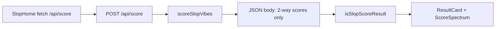

# Remove neutral bucket, confidence, aiPosts, aiPct

## Scope (files to modify)

| File | Change |
|------|--------|
| [lib/scoring/types.ts](lib/scoring/types.ts) | `RawLabScores`: only `openAI`, `anthropic`. `SlopScoreResult`: `scores` two fields only; drop `confidence`, `aiPosts`, `aiPct`. Keep `totalPosts`, `postsAnalyzed`, rest unchanged. Update the comment on `RawLabScores` (no longer a “triple”). |
| [lib/scoring/heuristic.ts](lib/scoring/heuristic.ts) | Full refactor per your CHANGE 2: strip NEUTRAL_AI, `neutralPoints`, all `dNeut` paths, `aiPosts`, `leanOpenCount`/`leanAnthCount`, `aiPct`, `confidenceCapFromAiPosts`, all confidence math, and `emptyFields` (inline `postsAnalyzed`/`totalPosts` only). Apply new normalization, headline block, return shape, `orderedReceipts` → `slice(0, 5)` (your `topReceipts` name: keep as `orderedReceipts.slice(0, 5)` or alias `topReceipts`—either is fine). **Loop structure:** when `!openMFinal && !anthMFinal`, do not add lab points (no neutral sink); when labs present, keep existing Open/Anth weighting **except** `bothLabs` `dNeut` and the `postOpen`/`postAnth`/`postNeut` lean block. **Early empty-posts return:** `scores: { openAI: 50, anthropic: 50 }` (aligns with `sum < 1e-6` behavior), no removed fields, inline post counts. **Note:** the comment on line 18 (`Vendor-neutral model names`) is about vendor-agnostic *terms*, not the score bucket—leave it. |
| [components/result-card.tsx](components/result-card.tsx) | Remove neutral `ScorePill` and `grid-cols-3` → `grid-cols-2` for Anthropic + OpenAI only. Narrow `ScorePill` `tone` to `"openai" \| "anthropic"` and drop neutral ring branch. [components/score-spectrum.tsx](components/score-spectrum.tsx) is already two-way; no change unless you want copy tweaks. |
| [components/slop-home.tsx](components/slop-home.tsx) | `isSlopScoreResult`: require `openAI` and `anthropic` only; **remove** `s.neutral` check. |
| [app/layout.tsx](app/layout.tsx) | Optional but recommended: metadata string still says “vs neutral posting-style…”—reword to two-way (e.g. OpenAI vs Anthropic only) so `app/` has no stale “neutral” product copy. **Do not** change [components.json](components.json) `baseColor: "neutral"` (shadcn token, unrelated). |

**Explicitly not editing (per your rules):** [app/api/score/route.ts](app/api/score/route.ts) (returns `scoreSlopVibes` as-is), [lib/providers/*](lib/providers), [lib/mock-data.ts](lib/mock-data.ts), term lists and numeric weights in heuristic (other than removing neutral-specific plumbing).

**Out of scope unless you want it:** [README.md](README.md) still describes a three-way breakdown; not required for `npm run build`.

## `SlopScoreResult` after changes (target)

```ts
export type SlopScoreResult = {
  handle: string;
  displayName?: string;
  scores: { openAI: number; anthropic: number };
  receipts: ScoreReceipt[];
  tags: string[];
  vibeHeadline: string;
  postsAnalyzed: number;
  totalPosts: number;
  meta: PostsFetchMeta;
};
```

(`RawLabScores` matches `{ openAI: number; anthropic: number }`.)

## Post-implementation verification

- Run `npm run build` and confirm **zero** TypeScript errors.
- List all modified files in the session summary (expect at minimum the five files above if layout is updated).

## Flow (unchanged architecture)


