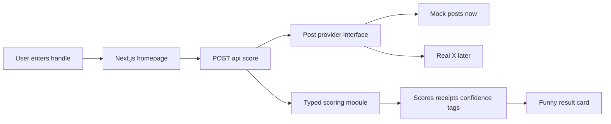

# Slop Sentiment Index MVP Plan

## A. MVP Scope

Ship a demo-ready entertainment app that works even without X API access.

Core MVP:
- Single-page web app with hero, X handle input, mocked example buttons, loading/error/empty states, and a screenshot-worthy result card.
- API endpoint that accepts a handle and returns typed scoring output.
- Mock/demo provider with at least 3 sample accounts so the app works immediately.
- Provider abstraction for post ingestion so live X fetching can be added later without touching UI/scoring contracts.
- Explainable scoring module that outputs:
  - OpenAI score
  - Anthropic score
  - Neutral/independent score
  - Confidence score
  - 3 to 5 humorous receipts
  - Optional tags when obvious, such as `launch-day activation`, `benchmark glazing`, `marketing-copy tone`, `indie poster`
- Product language consistently frames results as posting-style similarity / lab vibe alignment, not factual affiliation, bribery, employment, or paid promotion.

Out of scope for 8-hour MVP:
- Auth, database, account history persistence, payments, sharing backend, or user profiles.
- Fully reliable live X integration unless credentials/API access already exist.
- Complex ML pipeline, embeddings store, or long-running jobs.
- Any claim that the app proves compensation, employment, coordination, or undisclosed sponsorship.

## Proposed Tech Stack

- Next.js App Router with TypeScript.
- Tailwind CSS for layout and styling.
- shadcn/ui for fast polished primitives: `Button`, `Input`, `Card`, `Badge`, `Alert`, `Skeleton` if needed.
- Next.js API route under `app/api/score/route.ts` for scoring.
- Mock-first ingestion provider with optional real provider stub.
- Heuristic scorer first for reliability; optional LLM scoring can be layered behind the same scoring contract if time/API keys allow.

## B. Architecture

Simple request flow:



Key design choices:
- Use mock data first so the demo works within minutes.
- Keep provider and scorer independent: providers only fetch posts; scoring only receives normalized posts.
- Use deterministic heuristic scoring for the first pass because it is fast, cheap, explainable, and reliable during a hackathon.
- Leave an `LLM` scoring adapter optional, not required for the core demo.

## C. Folder Structure

Planned clean scaffold:

```text
.
├── app/
│   ├── api/
│   │   └── score/
│   │       └── route.ts
│   ├── globals.css
│   ├── layout.tsx
│   └── page.tsx
├── components/
│   ├── examples-row.tsx
│   ├── handle-form.tsx
│   ├── result-card.tsx
│   ├── score-spectrum.tsx
│   └── state-message.tsx
├── components/ui/
│   └── shadcn generated components
├── lib/
│   ├── mock-data.ts
│   ├── providers/
│   │   ├── mock-provider.ts
│   │   ├── types.ts
│   │   └── x-provider.ts
│   ├── scoring/
│   │   ├── heuristic.ts
│   │   └── types.ts
│   └── utils.ts
├── public/
├── README.md
├── package.json
├── tailwind.config.ts
└── tsconfig.json
```

## D. Implementation Phases

1. Scaffold foundation
- Create Next.js + TypeScript + Tailwind app structure.
- Add shadcn/ui setup and a minimal dark-mode-friendly theme.
- Add README skeleton with setup and demo commands.

2. Mock-first backend contract
- Define normalized post types and scoring result types.
- Add mock fixtures for at least 3 demo accounts.
- Implement `PostProvider` abstraction and `MockPostProvider`.
- Create `POST /api/score` endpoint that validates handle input, fetches mock posts, scores them, and returns JSON.

3. Explainable scoring v1
- Implement deterministic heuristic scoring around company/model mentions, sentiment-like phrasing, booster language, launch hype, and independence signals.
- Return normalized OpenAI / Anthropic / neutral scores that sum cleanly or are clearly comparable.
- Generate 3 to 5 receipts from actual matched signals.
- Add confidence based on amount of evidence and number of posts.

4. Frontend demo flow
- Build homepage hero, input form, example account buttons, loading state, error state, empty state, and result rendering.
- Build the screenshotable result card with scores, confidence, receipts, tags, and entertainment disclaimer.
- Add horizontal Anthropic-to-OpenAI spectrum if time remains.

5. Polish and verification
- Run typecheck/lint/build if available.
- Tune mock examples so the 60-second demo has clear contrast.
- Update README with local setup, demo handles, fallback behavior, and non-defamatory framing.

## E. Risks And Fallback Plan

Critical risks:
- X API access may be unavailable or unreliable during the hackathon.
- LLM calls may add latency, cost, API-key setup friction, and nondeterministic demo behavior.
- Humor can drift into defamatory framing if wording is not constrained.
- Scoring can feel magical unless receipts directly explain visible signals.

Fallback plan:
- Default to mock provider for all demos.
- Keep real X provider as a clean stub or optional adapter only.
- Use deterministic heuristic scoring for the MVP; add LLM only if the core demo is already stable.
- Put a clear product disclaimer in the UI and README: this is a satirical posting-style similarity score, not evidence of employment, payment, affiliation, or promotion.
- Make example buttons the primary demo path so the app demos reliably in under 60 seconds.